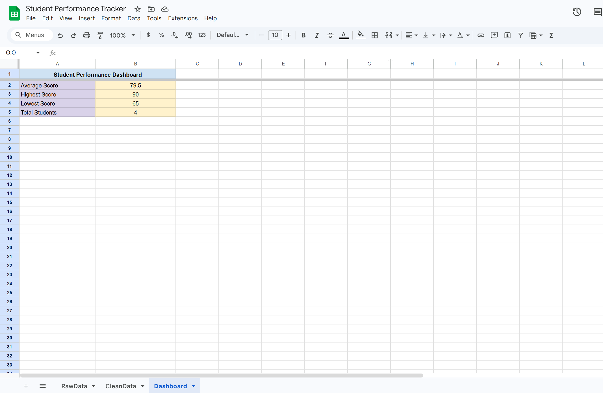

# Automated Student Performance Tracker

## Overview

The Automated Student Performance Tracker is a data automation system that collects, cleans, analyzes, and visualizes student performance data using Google Sheets automation and Python analytics.

The system validates student data, generates performance KPIs, and produces analytics reports automatically.

---

## Features

* Automated data validation using Google Apps Script
* Data cleaning pipeline (RawData → CleanData)
* Performance KPI dashboard
* Python analytics and reporting
* Visualization of student performance
* End-to-end data processing workflow

---

## Tech Stack

* Google Sheets
* Google Apps Script (JavaScript)
* Python
* Pandas
* Matplotlib

---

## System Workflow

Raw Data → Data Cleaning → KPI Dashboard → Python Analytics

---

## Live Demo

Google Sheets Dashboard:
https://docs.google.com/spreadsheets/d/1WcYEBjhPHMKEVuaMEDbW1qWigXXGpDQX1ft3fw-dchM/edit?usp=sharing

---

## Dashboard Preview

---

## Project Structure

* apps_script → Google Sheets automation
* python → data processing scripts
* sample_data → test dataset
* docs → architecture documentation
* screenshots → dashboard preview

---

## Future Improvements

* Automatic Google Sheets to Python integration
* Scheduled data processing
* Machine learning performance prediction

